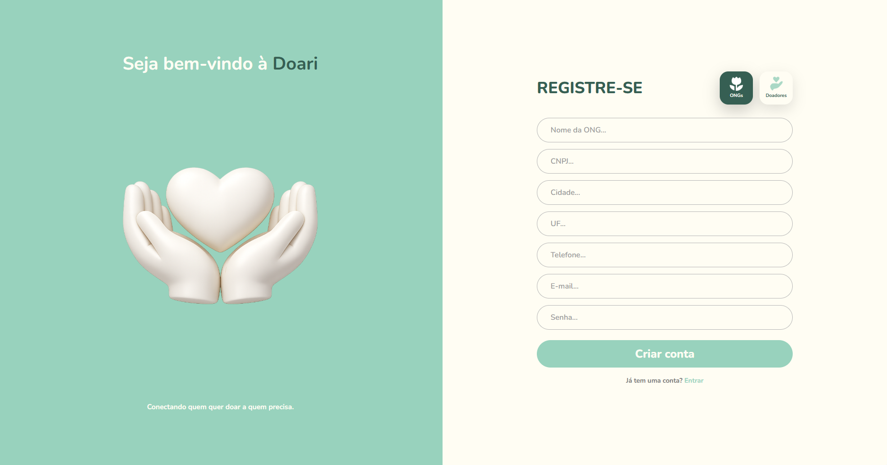
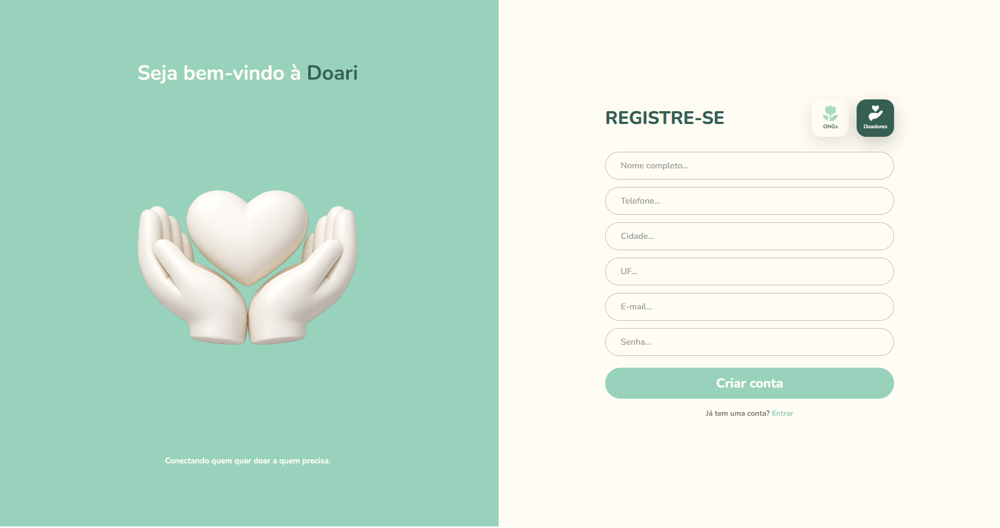
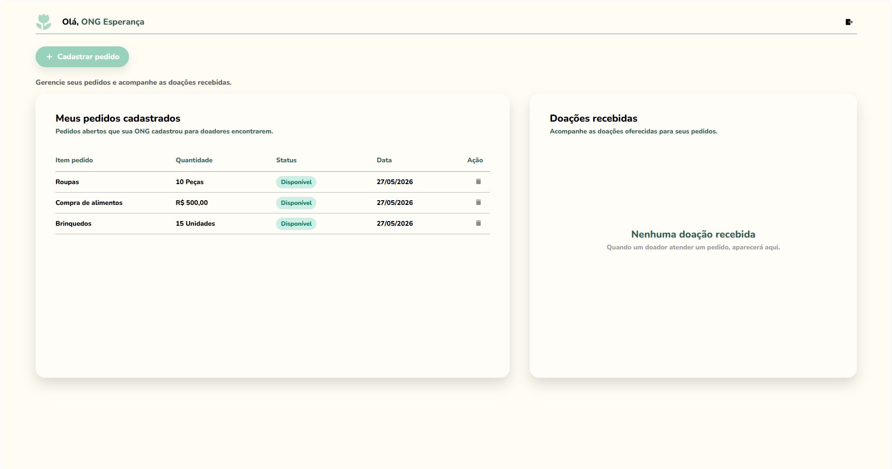
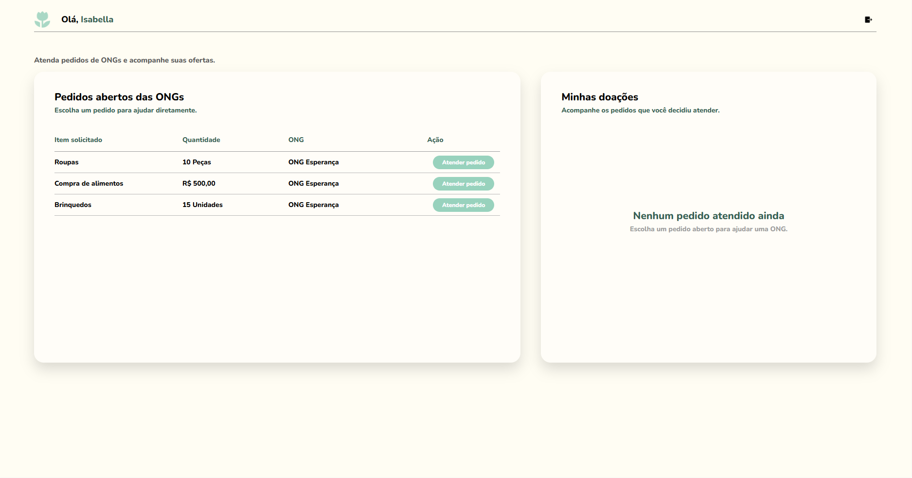
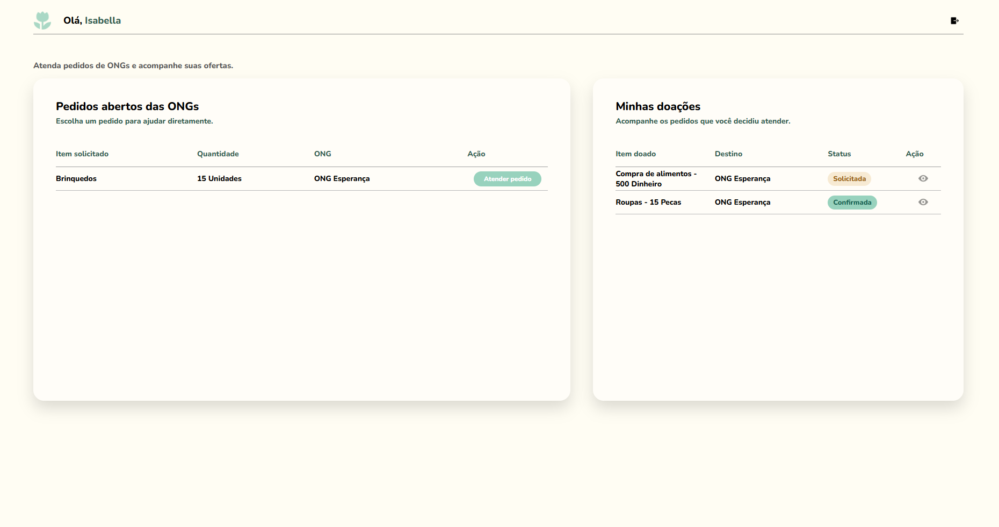
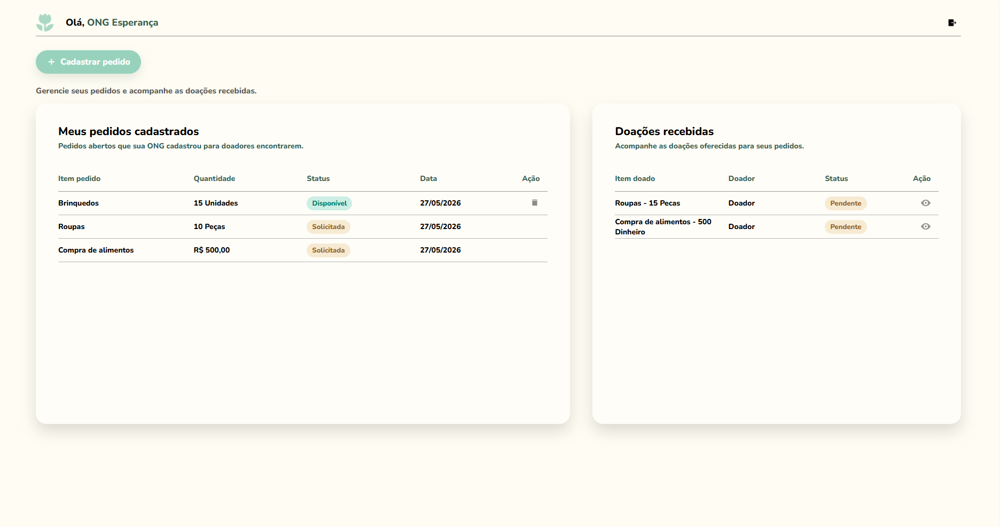
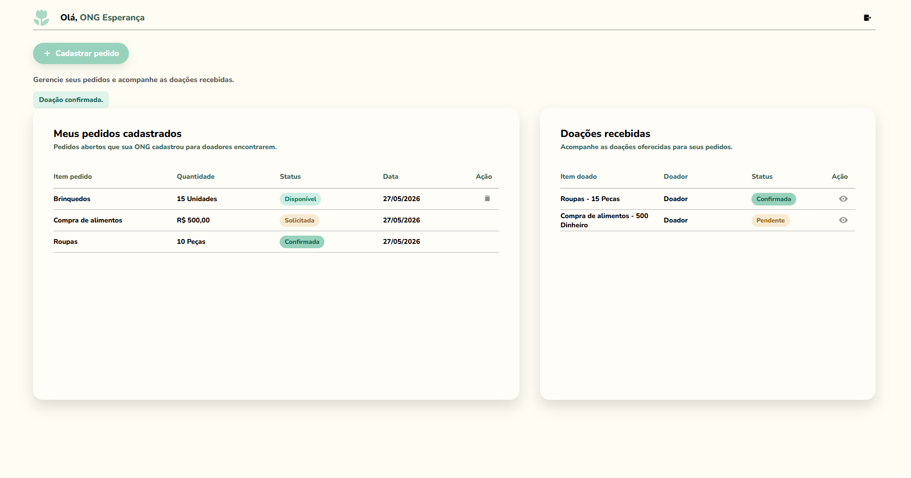

<div align="center">


# Doari

**Conectando quem quer doar a quem precisa.**

Doari é uma plataforma web que aproxima ONGs e doadores. ONGs cadastram pedidos de ajuda, doadores escolhem como contribuir — e o sistema acompanha tudo, da oferta até a entrega.

</div>

---

## Índice

- [Sobre o Projeto](#sobre-o-projeto)
- [Funcionalidades](#funcionalidades)
- [Demonstração Visual](#demonstração-visual)
- [Arquitetura](#arquitetura)
- [Tecnologias](#tecnologias)
- [Como Executar](#como-executar)
- [Fluxo Principal](#fluxo-principal)
- [Status das Doações](#status-das-doações)
- [Estrutura de Pastas](#estrutura-de-pastas)
- [Melhorias Futuras](#melhorias-futuras)
- [Equipe](#equipe)

---

## Sobre o Projeto

O Doari foi desenvolvido como uma aplicação Java com arquitetura em microserviços, com o objetivo de facilitar o processo de doação entre pessoas interessadas em ajudar e organizações que possuem necessidades cadastradas.

Na plataforma:

- ONGs podem criar pedidos de itens físicos ou dinheiro
- Doadores podem visualizar pedidos abertos e enviar ofertas
- A ONG pode aceitar ou recusar cada oferta recebida
- Após aceitar, a ONG confirma quando a doação foi entregue

---

## Funcionalidades

<details>
<summary><strong>Perfil ONG</strong></summary>

- Cadastro e login
- Criação e exclusão de pedidos
- Visualização dos próprios pedidos
- Acompanhamento das doações recebidas
- Confirmação ou recusa de ofertas
- Confirmação de entrega

</details>

<details>
<summary><strong>Perfil Doador</strong></summary>

- Cadastro e login
- Visualização de pedidos abertos de todas as ONGs
- Envio de ofertas com dados de contato
- Acompanhamento das próprias doações
- Visualização de status em tempo real

</details>

---

## Demonstração Visual

### Cadastro de ONG
Tela utilizada para registrar uma organização no sistema.



---

### Cadastro de Doador
Tela utilizada para registrar um usuário do tipo doador.



---

### Painel da ONG — Pedidos Criados
Após o login, a ONG visualiza os pedidos cadastrados e acompanha as doações recebidas.



---

### Painel do Doador — Pedidos Disponíveis
O doador visualiza os pedidos abertos pelas ONGs e escolhe qual deseja atender.



---

### Visão Geral do Doador
Depois de atender pedidos, o doador acompanha suas doações e os respectivos status.



---

### Pedidos da ONG em Andamento
Quando um doador atende um pedido, a ONG visualiza a oferta como pendente, podendo confirmar ou recusar.



---

### Pedido Confirmado pela ONG
Após a confirmação, o pedido e a doação mudam de status, permitindo o acompanhamento até a entrega.



---

## Arquitetura

O projeto foi organizado em serviços separados:

```
doari
├── frontend
├── backend
│   ├── usuarios-service
│   ├── doacoes-service
│   ├── notificacao-service
│   └── docker
└── docker-compose.yml
```

| Serviço               | Porta | Responsabilidade                                  |
|-----------------------|-------|--------------------------------------------------|
| `frontend`            | 8080  | Interface web com Thymeleaf                      |
| `usuarios-service`    | 8081  | Cadastro, login, autenticação e perfis           |
| `doacoes-service`     | 8082  | Pedidos, doações e alteração de status           |
| `notificacao-service` | 8083  | Notificações internas do sistema                 |
| `mysql`               | 3306  | Banco de dados                                   |

---

## Tecnologias

| Categoria      | Tecnologias                                       |
|----------------|---------------------------------------------------|
| Backend        | Java 21, Spring Boot, Spring MVC, Spring Data JPA |
| Frontend       | Thymeleaf, HTML, CSS, JavaScript                  |
| Banco de Dados | MySQL 8.4                                         |
| Infraestrutura | Docker, Docker Compose, Maven                     |

---

## Como Executar

### Pré-requisitos

- [Docker Desktop](https://www.docker.com/products/docker-desktop/)
- [Git](https://git-scm.com/)
- Java 21 *(opcional, para rodar serviços manualmente)*

### Rodando com Docker

```bash
# Clone o repositório
git clone https://github.com/iisab3lla/doari.git
cd doari

# Suba os containers
docker-compose up -d --build
```

Acesse em: `http://localhost:8080/login`

### Comandos úteis

```bash
# Parar os containers
docker-compose down

# Parar e apagar os dados do banco
docker-compose down -v

# Ver containers em execução
docker ps

# Ver logs por serviço
docker logs doari-frontend
docker logs doari-usuarios-service
docker logs doari-doacoes-service
docker logs doari-notificacao-service
```

---

## Fluxo Principal

```
1. ONG cria uma conta
2. ONG cadastra um pedido
3. Doador cria uma conta
4. Doador visualiza os pedidos disponíveis
5. Doador escolhe um pedido e envia uma oferta  →  status: SOLICITADA
6. ONG analisa a oferta
   ├── Recusa    →  status: RECUSADA
   └── Confirma  →  status: CONFIRMADA
7. ONG recebe a doação e marca como entregue    →  status: ENTREGUE
```

---

## Status das Doações

| Status       | Significado                                           |
|--------------|-------------------------------------------------------|
| `DISPONIVEL` | Pedido aberto, aguardando doadores                    |
| `SOLICITADA` | Doador enviou oferta, aguarda resposta da ONG         |
| `CONFIRMADA` | ONG aceitou a oferta                                  |
| `RECUSADA`   | ONG recusou a oferta                                  |
| `ENTREGUE`   | ONG confirmou o recebimento da doação                 |
| `REMOVIDO`   | Registro removido logicamente                         |

---

## Banco de Dados

O projeto utiliza MySQL com três bases:

| Banco             | Principais tabelas      |
|-------------------|-------------------------|
| `usuarios_db`     | `usuario`               |
| `doacoes_db`      | `pedido`, `doacao`      |
| `notificacoes_db` | `notificacao`           |

O script inicial está em `backend/docker/mysql/init.sql`. O banco é criado limpo ao rodar o Docker.

---

## Estrutura de Pastas

```
a3_daori-main
├── backend
│   ├── docker
│   │   └── mysql
│   │       └── init.sql
│   ├── doacoes-service
│   ├── notificacao-service
│   ├── usuarios-service
│   └── pom.xml
├── frontend
│   ├── src
│   │   └── main
│   │       ├── java
│   │       └── resources
│   │           ├── static
│   │           └── templates
│   ├── Dockerfile
│   └── pom.xml
├── assets
├── docker-compose.yml
└── README.md
```

---

## Melhorias Futuras

- [ ] Tela administrativa para acompanhar todos os usuários
- [ ] Upload de imagens para pedidos e doações
- [ ] Recuperação de senha
- [ ] Validação real de CNPJ
- [ ] Filtros por cidade, tipo de item e status
- [ ] Integração com e-mail ou WhatsApp para notificações
- [ ] Histórico completo de entregas

---

## Equipe

Projeto desenvolvido para fins acadêmicos.

| Nome | GitHub |
|------|--------|
| Adicione os integrantes aqui | — |

---

<div align="center">
Desenvolvido para fins acadêmicos.
</div>
